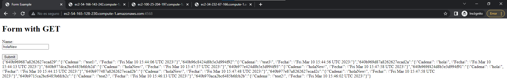
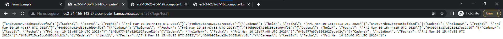
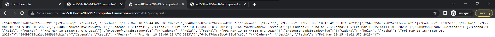
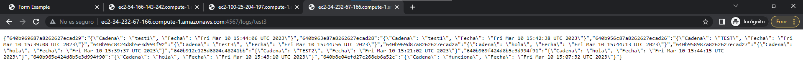

# AREP Taller 5

Aplicativo que realiza la inscripción de logs en una base de datos no relacional. El log a guardar se debe de escribir en un campo de texto y al momento de enviarlo a la base de datos esta responde con los 10 últimos logs guardados en ella.

## Iniciando

### Prerequisites

- Maven - Administrador de dependencias y administrador del ciclo de vida del proyecto
- Java - Ambiente de desarrollo
- Git - Sistema de control de versiones y descarga del repositorio
- Docker - Sistema de control de contenedores

### Descripción de la arquitectura

En esta aplicación tenemos la conexión a una base de datos mediante 3 instancias de una aplicación de logs, así mismo tenemos un balanceador de carga que funciona mediante el algoritmo de round robin para distribuir las peticiones que llegan sobre los 3 servidores que se comunican con nuestra base de datos no relacional.

#### Diseño de clases
Se realiza un "Repositorio" diferente para cada gran componente, en este caso tenemos los logserver que se comunican con la base de datos en un directorio aparte de el loadbalancer, puesto que en escencia tienen un funcionamiento diferente.
Para el servicio de comunicación de la base de datos se implementa una interfaz, para que un futuro se pueda usar mediante inyección de dependencias, así mismo al momento de implementar el balanceador de carga, puesto que se contempla la posibilidad de usar otro algoritmo en este.

### Instalando el entorno

Para correr el programa primero se descarga el repositorio con el siguiente comando
```
https://github.com/Derjasai/AREP_Lab05.git
```

Una vez clonado el repositorio ingrese en la carpeta descargada y corra el siguiente comando para ejecutar el programa

```
mvn clean install
```

## Documentación
Se encuentra la documentación en la carpeta nombrada "javadoc", para generar nueva documentación puede correr el siguiente comando
```
mvn javadoc:javadoc
```
La nueva documentación generada puede encontrarla en la ruta /target/site/apidocs

## Comprobración del aplicativo mediante test de usuario

Esta es la aplicación de manera simple que realiza una solicitud GET a nuestros servicios de logs


Como podemos ver en esta imagen el servidor guarda nuestro último log y nos muestra los últimos logs que hay en la base de datos, en este caso no alcanza a mostrar 10 porque no hay suficientes logs en la base de datos


En las siguientes imagenes podemos ver diferentes consultas a los servidores que se comunican con la base de datos y el formato de respuesta es un JSON




## Despliegue

Puede ver el despliegue en el siguiente link http://ec2-34-228-158-179.compute-1.amazonaws.com:45000

Se realiza el despliegue del aplicativo en una máquina virtual EC2 de AWS mediante el uso de dockers.
Para realizar el despligeue usted mismo saque los contenedores de ambos directorios, despues realice el siguiente comando
```
docker-compose up -d
```
Una vez creado corra el comando en ambos directorios sus contenedores e imágenes serán creados.
Cuando suba las imágenes al Docker Hub para querer descargarlas en su máquina virtual asegurese de que en el código entregado se cambie la IP en la clase RoundRobin y en MongoDBServiceImpl

Cuando las imágenes queden subidas en el Docker Hub descargue y corra estas con el siguiente comando
```
docker run -d -p port:6000 --name firstdockerimageaws user/firstsprkwebapprepo
```
Donde port es el puerto donde quiera que corra el servicio y user el nombre de su usuario en docker hub
## Construido con

* [Maven](https://maven.apache.org/) - Dependency Management

## Versonamiento

Versión 1.0

## Autores

* Daniel Esteban Ramos Jimenéz